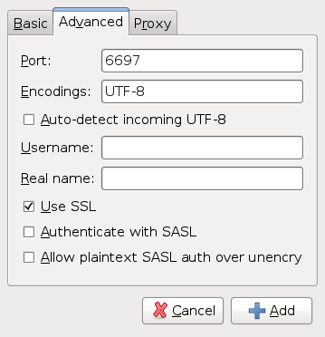

Common to purple based clients
==============================

Pidgin, Empathy and other libpurple based clients store the CA certificates in
a common place.

Pidgin
======

Next, add the IRC server to your client:

Click "Add" in the "Manage Accounts" dialog and enter the following
information in the Basic tab:

Now, we need to tell Pidgin that we want to have an encrypted connection. Make
sure you change the port number to 6697 and check the SSL checkbox.

If you get the following message box, the installation of your CA certificate
store went wrong.

In that case, click "View Certificate", which will bring this information
window:

Copy the information and then click OK and accept and contact a staff member
to help solve the problem.
