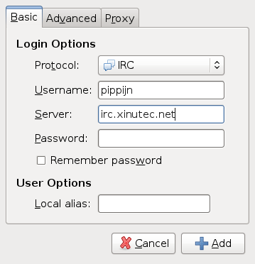
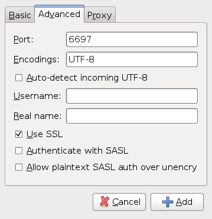
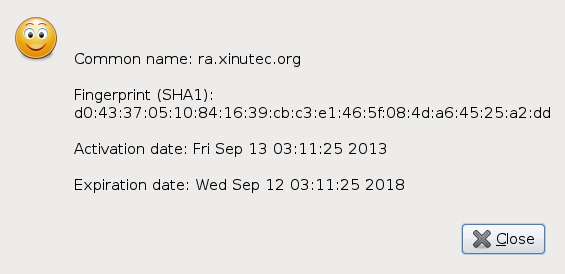

Connecting to IRC
=================

This page provides short explanations on how to add the Xinutec IRC Network to
your IRC client and how to connect to it. If your client is not listed here,
but you would like to add a short how-to, perhaps with screenshots, feel free
to contact our staff.

Irssi
-----

First, download the [CA certificate](ca.crt). Save this under
`~/.irssi/xinutec.pem`. Then, add the Xinutec network to your configuration
with the following command:

        /network add xinutec

Without client certificate, enter this command, all on one line:

        /server add -ssl_cafile ~/.irssi/xinutec.pem
                    -auto -network xinutec irc.xinutec.net 6697

In case you do have a client certificate with associated private key, save
them both in `~/.irssi/client.pem` and use the following command, again all on
one line:

        /server add -ssl_cafile ~/.irssi/xinutec.pem
                    -ssl_cert ~/.irssi/client.pem
                    -auto -network xinutec irc.xinutec.net 6697

In case you already registered the network and server in your client, you can
either remove the server with `/server remove irc.xinutec.net` and re-add it
as above, or manually edit the configuration file, so that it contains a
section like this:

        {
          address = "irc.xinutec.net";
          chatnet = "xinutec";
          port = "6697";
          ssl_cert = "~/.irssi/client.pem";
          ssl_cafile = "~/.irssi/xinutec.pem";
          autoconnect = "yes";
        },

Common to purple based clients
------------------------------

Pidgin, Empathy and other libpurple based clients store the CA certificates in
a common place.

Our Xinutec [CA certificate](ca.crt) should be saved in the global CA store.
Save it as `Xinutec_CA.pem` under `/usr/share/purple/ca-certs` (or
`/usr/local/share/purple/ca-certs` as appropriate). Under Windows, save it
under `C:\Program Files\Pidgin\ca-certs` (or `C:\Program Files
(x86)\Pidgin\ca-certs` as appropriate).

Pidgin
------

Refer to the above section about purple clients for the CA certificate.

Next, add the IRC server to your client:

Click "Add" in the "Manage Accounts" dialog and enter the following
information in the Basic tab:

Now, we need to tell Pidgin that we want to have an encrypted connection. Make
sure you change the port number to 6697 and check the SSL checkbox.

If you get the following message box, the installation of our CA certificate
went wrong.

In that case, click "View Certificate", which will bring this information
window:

Copy the information and then click OK and accept and contact a staff member
to help solve the problem.
