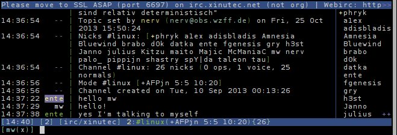

Weechat
=======

Weechat is a ncurses based IRC client. It currently does not support assigning
a CA on a per per-network basis, so you might need to add the [Let's
Encrypt](https://letsencrypt.org/) root certificate to your certificate store.
If you have a separate certificate store, you'll probably know how to do this.
If you don't, no further steps are required.

Then, to connect:

	/server add xinutec irc.xinutec.net/6697 -ssl

There are more flags than `-ssl`, most importantly also `-autoconnect`. See
`/help server` for more information.

Finally, connect the newly created server:

	/connect xinutec

See you there!

